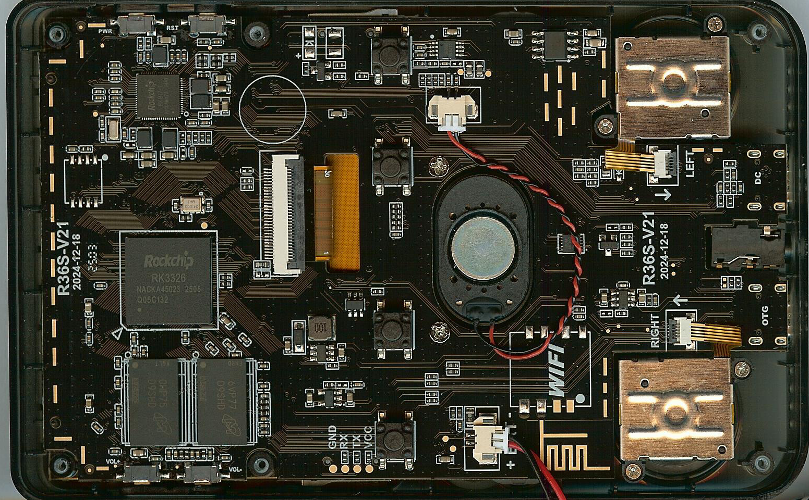

# SoC Mainline Ports

Porting mainline U-Boot not only to the R36S, but also to other SoCs for fun and knowledge.

## R36S / R36X

The R36S and the R36X variant with an embedded Wi-Fi module, is a compact handheld game console with a competitive price. Its main components are the Rockchip RK3326 SoC, an LCD, and a multifunctional PMIC providing RTC, audio codec, battery charger, and more.

This platform has a limited but functional implementation in mainline U-Boot, while the Rockchip vendor U-Boot 2019.07 provides more or less full functionality. All of this makes the R36S a perfect candidate for exploring what it takes to bring this platform to mainline U-Boot.




### Specifications

- Rockchip RK3326 quad-core ARM Cortex-A35 CPU with GPU
- 1 GB Micron DDR3 RAM
- RK817 multifunctional PMIC with RTC, audio codec, battery charger and battery gauge
- 3.5-inch LCD panel (640 x 480) Sitronix ST7703 or Elida KD35T133 or possibly a clone
- Digital buttons and two analogue joysticks
- TCS7191A Class-D audio power amplifier
- ME4057 lithium-ion battery linear charger
- Two SD card slots
- USB-C charging port
- USB-C OTG port (non-working when the internal WiFi module is soldered)
- Headphone output

### Hardware Design Quirks
#### Audio
- Headphone detection is not connected to any GPIO pin
- Switching between the headphones and speaker is performed using an analog circuit
- The speaker is connected to left audio channel
- Both headphone channels are connected to right audio channel

#### USB OTG
- The internal soldered Wi-Fi module is connected to the same USB data lines as the USB OTG port, making the OTG port unusable when the Wi-Fi module is installed

#### Power Management
- RK817 PMIC includes a battery charger, but it is not utilized; charging is handled by the ME4057 basic linear charger
- RK817 PMIC is capable of supplying power to the USB OTG port, but this feature is not used; instead, a basic step-up converter is used to supply power to the OTG port
- Operation without a battery is not supported, as the battery serves as the main power source. The USB-C DC input supplies power only to the ME4057 battery charger

#### Joysticks
- There are two analog joysticks on the board. Each joystick provides analog values for the horizontal and vertical axes, resulting in four analog channels in total. All four channels are connected to a single ADC channel through a 4:1 analog multiplexer.

### U-Boot Support

| Component  | Device          | Driver name        | Mainline support | Ported U-Boot tag  | Comment | Implementation Notes |
| ---------- | --------------- | ------------------ | ---------------- | ------------------ | - | - |
| PMIC RK817 | RTC             | `rk817_rtc`        | No               | v2026.07-ports-r1  |Supports only time set and get, no alarm | Written specifically for RK817 only as this appears not to suffer from 31. November bug as RK808 do.
| PMIC RK817 | CLKout          | `rk817_clkout`     | No               | v2026.07-ports-r1  |Controls 32,768 kHz clock output | Ported from Rockchip Vendor U-Boot |
| PMIC RK817 | Audio Codec     | `rk817_audio`      | No               | v2026.07-ports-r1  |Supports only 16-bit, 48 kHz sample rate playback | Inspired by Rockchip Vendor U-Boot |
| RK3326     | I2S             | `rockchip_i2s`     | Semi             | v2026.07-ports-r1  |Hard coded playback configuration 16 bit depth, 48000 sample rate playback | Fixed I2S clock configuration  |
| RK3326     | RNG             | `rockchip-rng`     | Yes              | v2026.07-ports-r1  | | Activation in FDT |
| RK3326     | Watchdog        | `designware_wdt`   | Yes              | v2026.07-ports-r1  | | Activation in FDT |
| RK3326     | Temperature ADC | `rockchip_thermal` | No               | v2026.07-ports-r1  |Measures two temperature channels CPU and GPU, but U-Boot supports only one CPU channel. | Ported from Rockchip Vendor U-Boot |
|            | D-Pad           | `button_gpio`      | Yes              | v2026.07-ports-r1  |All digital except power button defined in FDT | Definition in FDT |
|            | Sound card      | `rockchip_sound`   | Yes              | v2026.07-ports-r1  | | Modernized; removed explicit pinctrl; hard coded clk rate moved to I2S driver |

### Trusted Firmware-A Support

Instead of relying on the proprietary Rockchip TF-A binary blob, mainline Trusted Firmware-A (TF-A) is built from source.

The project currently uses TF-A v2.15.0:

https://github.com/TrustedFirmware-A/trusted-firmware-a/tree/v2.15.0


## Building

This project expects the U-Boot and Trusted Firmware-A source trees to be located next to the project directory:

```
parent/
├── u-boot/
├── trusted-firmware-a/
└── soc-mainline-ports/
```

The default cross-compiler is expected at:

`/opt/toolchain/arm-gnu-toolchain-15.3.rel1-x86_64-aarch64-none-linux-gnu/bin/`

The paths can be overridden when invoking make:

```
make UBOOT_DIR=/path/to/u-boot \
     TFA_DIR=/path/to/trusted-firmware-a \
     TOOLCHAIN_PATH=/path/to/toolchain/bin
```

### Build U-Boot

The default build target is the R36S:

```
make
```

The resulting files are placed in:

```
build/r36s/u-boot/
```

To build another supported platform:

```
make BOARD=<board>
```

### Create an SD Card Image

To create an SD card boot image:

```
make sdcard
```

The resulting image is located in:

```
build/r36s/sd_bootloader.img`
```

To build and create an image for another board:

```
make BOARD=<board> sdcard
```