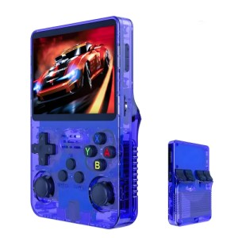

# SoC Mainline Ports

Porting mainline U-Boot to the R36S and other SoCs for fun and knowledge.

## Getting Started

This repository provides only the build system and documentation. Other components, such as ported U-Boot and Trusted Firmware-A (TF-A), are maintained in separate repositories.

The main goal of this project is to bring SoC platforms closer to fully open-source mainline support. Where possible, proprietary firmware blobs are avoided, including proprietary DDR initialization and Rockchip TF-A binaries.

### Prerequisites

No special software is required beyond the usual development tools. You will need Git, GNU Make, a native GCC toolchain, an AArch64 cross-compiler, U-Boot build dependencies, and the dependencies required by Trusted Firmware-A.

The project was built using the **Arm GNU Toolchain 15.3.rel1** available from [Arm GNU Toolchains repository](https://gitlab.arm.com/tooling/gnu-toolchains-for-arm/-/tree/releases/15.3.rel1)

The toolchain location can be overridden when invoking `make`, otherwise the default path is used:
```
TOOLCHAIN_PATH ?= /opt/toolchain/arm-gnu-toolchain-15.3.rel1-x86_64-aarch64-none-linux-gnu/bin
```

### Source Tree

To keep this project simple, no Git submodules are used. The build system expects repositories to be located next to each other:

```
/
├── soc-mainline-ports/
├── u-boot-mainline-rockchip/
└── trusted-firmware-a/
```

#### soc-mainline-ports

This repository contains the build system and documentation for the supported platforms.

#### u-boot-mainline-rockchip

[Mainline U-Boot with ported platforms](https://github.com/rforro/u-boot-mainline-rockchip)

This U-Boot repository uses Git tags to identify the versions required by the individual platform ports. These custom tags follow the U-Boot release version they are based on, with an additional port revision suffix. The required U-Boot tag is listed in the **U-Boot Support** table in each platform's section below.

Before building a platform, change to the U-Boot repository and check out the tag specified for that platform, for example:

```
git checkout v2026.07-ports-r1
```

#### trusted-firmware-a

Use the TF-A version recommended by the platform you are building (see below) from [the official Trusted Firmware-A repository](https://github.com/TrustedFirmware-A/trusted-firmware-a)

### Build

Build an image for default target R36S:

```
make
```

The bootable image is then placed under:

```
build/r36s/u-boot/
```

To build another supported platform:

```
make BOARD=<board>
```

### Bootable SD card Image

The SD card can be written either directly from CLI e.g.

```
dd if=build/r36s/u-boot/u-boot-rockchip.bin of=/dev/<sd-card-dev> bs=512 seek=64 conv=fsync
```

Alternatively, an SD card image file can be generated and then written using another tool:

```
make sdcard
```

**NOTE**: Rockchip's proprietary firmware uses a baud rate of **1,500,000**, which is bit unusual. If there are no boot logs, try different buad rates including 1500000.

## Platform R36S / R36X



The R36S and the R36X, a variant with an embedded Wi-Fi module, are compact handheld game consoles available at a competitive price. Their main components are the Rockchip RK3326 SoC, an LCD, and a multifunctional PMIC providing RTC, audio codec, battery charger, and more.

This platform has limited but functional support in mainline U-Boot, while the Rockchip vendor U-Boot 2019.07 provides more or less full functionality, albeit using proprietary DDR initialization and TF-A binary blob. This makes the R36S a perfect candidate for exploring what it takes to bring this platform to mainline U-Boot.

<details>
<summary>R36S PCB rear side</summary>


</details>

### Specifications

- Rockchip RK3326 quad-core ARM Cortex-A35 CPU with GPU
- 1 GB Micron DDR3 RAM
- RK817 multifunctional PMIC with RTC, audio codec, battery charger and battery gauge
- 3.5-inch LCD panel (640 x 480) Sitronix ST7703 or Elida KD35T133 or possibly a clone
- Digital buttons and two analogue joysticks
- TCS7191A Class-D audio power amplifier
- ME4057 lithium-ion battery linear charger
- Two SD card slots
- USB-C charging port
- USB-C OTG port (non-functional when the internal WiFi module is soldered)
- Headphone output

<details open>
<summary>R36S Platform Details - hardware quirks and software compatibility</summary>

### Hardware Design Quirks
#### Audio
- Headphone detection is not connected to any GPIO pin
- Switching between the headphones and speaker is performed using an analogue circuit
- The speaker is connected to left audio channel
- Both headphone channels are connected to right audio channel

#### USB OTG
- The internal soldered Wi-Fi module is connected to the same USB data lines as the USB OTG port, making the OTG port unusable when the Wi-Fi module is installed

#### Power Management
- RK817 PMIC includes a battery charger, but it is not utilized; charging is handled by the ME4057 basic linear charger
- RK817 PMIC is capable of supplying power to the USB OTG port, but this feature is not used; instead, a basic step-up converter is used to supply power to the OTG port
- Operation without a battery is not supported, as the battery serves as the main power source. The USB-C DC input supplies power only to the ME4057 battery charger

#### Joysticks
- There are two analogue joysticks, each with horizontal and vertical axes. The four resulting analogue signals are connected to a single ADC channel through a 4:1 analogue multiplexer.

### U-Boot Support

The R36S U-Boot configuration is defined by the following files:

#### Defconfig
```
r36s_defconfig
```

#### Device tree

The R36S hardware description is split between the main device tree and U-Boot-specific device-tree additions:
```
arch/arm/dts/rk3326-r36s.dts
arch/arm/dts/rk3326-r36s-u-boot.dtsi
```

#### Board-specific code

R36S-specific U-Boot board code is located under:
```
board/rockchip/r36s/
```

The following table summarises the additional drivers and platform support used by the R36S port:

| Component  | Device          | Driver name        | Mainline support | Ported U-Boot tag  | Comment | Implementation Notes |
| ---------- | --------------- | ------------------ | ---------------- | ------------------ | - | - |
| PMIC RK817 | RTC             | `rk817_rtc`        | No               | v2026.07-ports-r1  | Supports only time set and get, no alarm | Written specifically for RK817 only as this appears not to suffer from November 31st bug as RK808 do.
| PMIC RK817 | CLKout          | `rk817_clkout`     | No               | v2026.07-ports-r1  | Controls 32,768 kHz clock output | Ported from Rockchip Vendor U-Boot |
| PMIC RK817 | Audio Codec     | `rk817_audio`      | No               | v2026.07-ports-r1  | Supports only 16-bit, 48 kHz playback | Inspired by Rockchip Vendor U-Boot |
| RK3326     | I2S             | `rockchip_i2s`     | Partial          | v2026.07-ports-r1  | Hard-coded playback configuration 16-bit depth, 48000 sample rate playback | Fixed I2S clock configuration  |
| RK3326     | RNG             | `rockchip-rng`     | Yes              | v2026.07-ports-r1  | | Enabled in FDT |
| RK3326     | Watchdog        | `designware_wdt`   | Yes              | v2026.07-ports-r1  | | Enabled in FDT |
| RK3326     | Temperature ADC | `rockchip_thermal` | No               | v2026.07-ports-r1  | Measures two temperature channels CPU and GPU, but U-Boot supports only one CPU channel. | Ported from Rockchip Vendor U-Boot |
|            | D-Pad           | `button_gpio`      | Yes              | v2026.07-ports-r1  | All digital except power button defined in FDT | Definition in FDT |
|            | Sound card      | `rockchip_sound`   | Yes              | v2026.07-ports-r1  | | Modernized; removed explicit pinctrl; hard-coded clk rate moved to I2S driver |

### Trusted Firmware-A Support

The preferred TF-A version for the R36S is:
```
v2.15.0
```

but Rockchip `rk3326_bl31_v1.37.elf` proprietary TF-A binary blob works as well.

</details>

## Contributing

Contributions are welcome. This project is primarily about experimenting with mainline support for SoCs and hardware platforms, so contributions do not have to be limited to code.

Do you know of an interesting device running Android or Linux, such as a TV box, car head unit, smart picture frame, etc.? Mention it in an issue.